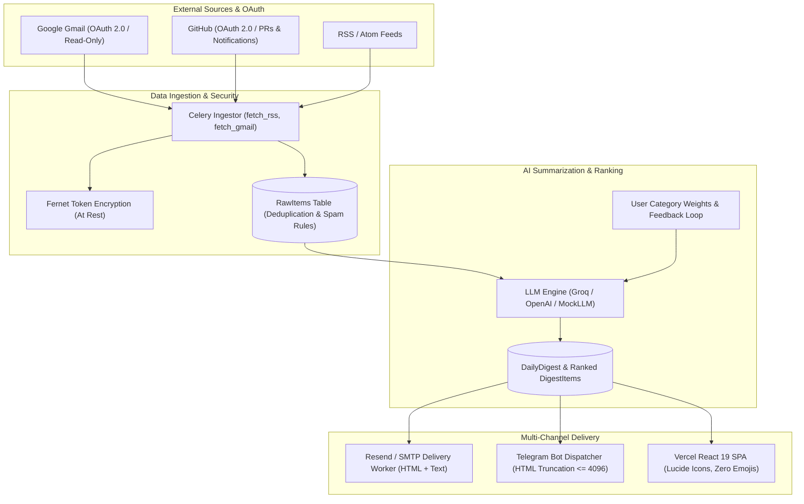

# MorningBrief

> **Personal AI Morning-Briefing & Ranked Notification Intelligence Web Application**  
> MorningBrief connects your communication and developer feeds (Google Gmail, GitHub, RSS, and more) and automatically synthesizes, ranks, and delivers an executive morning briefing every day at 07:00 AM via Email, Telegram, and the Web SPA.

---

## System Architecture



---

## Global Design System & Principles

MorningBrief adheres strictly to a clean, cohesive visual design system:
- **Design Tokens**:
  - Primary Indigo: `#4F46E5` (main), `#4338CA` (hover/dark), `#EEF2FF` (light/tint)
  - Amber Sunrise: `#F59E0B`, `#FFFBEB`
  - Emerald Accent: `#10B981`
  - Rose Accent: `#E11D48`
  - Canvas Background: `#FAFAF9` with soft ambient canvas glow
- **Typography**: Inter (clean body copy) and Sora (distinctive display headers)
- **Zero Emojis**: 100% Lucide React SVG icons across all web templates, emails, and code. No Unicode emojis permitted.
- **Micro-Interactions**: Optimistic feedback voting, interactive "Why this?" rationale tooltips, copy-to-clipboard Telegram integration.

---

## Environment Variables Reference

| Variable | Description | Default / Example | Required in Prod |
| :--- | :--- | :--- | :---: |
| `DEBUG` | Django debug mode (`False` in prod) | `False` | Yes |
| `SECRET_KEY` | Django cryptographic signing secret | `django-insecure-...` | Yes |
| `ENCRYPTION_KEY` / `FERNET_KEY` | 32-byte Fernet key for encrypting OAuth tokens | *(Generated base64 key)* | Yes |
| `ALLOWED_HOSTS` | Comma-separated allowed hostnames | `.onrender.com,localhost` | Yes |
| `CORS_ALLOWED_ORIGINS` | Comma-separated frontend domains | `https://morningbrief.vercel.app` | Yes |
| `DATABASE_URL` | PostgreSQL connection string (Neon Postgres) | `postgresql://...` | Yes |
| `REDIS_URL` | Redis broker & backend URL (Upstash Redis) | `rediss://...` | Yes |
| `OPENAI_API_KEY` | OpenAI or Groq API Key | `gsk_...` / `sk-proj-...` | Yes |
| `OPENAI_BASE_URL` | OpenAI-compatible base URL (e.g., Groq) | `https://api.groq.com/openai/v1` | No |
| `LLM_MODEL` | LLM model identifier | `llama-3.3-70b-versatile` | No |
| `RESEND_API_KEY` | Resend API Key for transactional digest emails | `re_...` | Yes |
| `EMAIL_HOST` | SMTP server hostname | `smtp.resend.com` | Yes |
| `EMAIL_PORT` | SMTP server port | `587` | Yes |
| `EMAIL_HOST_USER` | SMTP username | `resend` | Yes |
| `EMAIL_HOST_PASSWORD` | SMTP password / API key | `re_...` | Yes |
| `DEFAULT_FROM_EMAIL` | Sender address for daily briefings | `MorningBrief <onboarding@resend.dev>` | Yes |
| `TELEGRAM_BOT_TOKEN` | Telegram Bot API Token from @BotFather | `123456:ABC-DEF1234ghIkl-zyx57W2v1u123ew11` | Optional |
| `TELEGRAM_BOT_USERNAME` | Telegram Bot username | `MorningBriefBot` | Optional |
| `GOOGLE_CLIENT_ID` | Google OAuth 2.0 Web Client ID | `...apps.googleusercontent.com` | Optional |
| `GOOGLE_CLIENT_SECRET` | Google OAuth 2.0 Web Client Secret | `GOCSPX-...` | Optional |
| `GOOGLE_REDIRECT_URI` | Google OAuth callback URL | `.../api/v1/connections/gmail/callback/` | Optional |
| `VITE_API_URL` | Frontend API base URL | `https://morningbrief-api.onrender.com/api/v1` | Yes |

---

## Local Development & Quickstart

### 1. Instant Demo Seeding (Under 1 Minute)
To test the entire workflow with realistic mock data (recruiter email, GitHub PR review, and tech news):

```bash
cd backend
python manage.py demo_seed
```
This automatically creates:
- **Demo User**: `demo@morningbrief.dev` / `DemoPassword123!`
- **Sample RawItems**: High-priority recruiter email, critical GitHub PR, tech intelligence articles
- **Compiled Daily Digest**: Ready for immediate inspection in the Web UI.

### 2. Backend Setup
```bash
cd backend
python -m venv venv
.\venv\Scripts\activate      # Windows (or source venv/bin/activate on Unix)
pip install -r requirements.txt
python manage.py migrate
python manage.py runserver 8000
```

### 3. Frontend Setup
```bash
cd frontend
npm install
npm run dev
```
Open `http://localhost:5173` in your browser.

---

## Automated Test Suites

### Backend Tests (pytest + pytest-django + factory_boy + responses)
All core modules (accounts, connections, digest, delivery, feedback, gmail, llm) are rigorously tested:
```bash
cd backend
pytest tests/ --cov=apps --cov-report=term-missing
```
Key backend test guarantees:
- **Accounts**: Registration, login, refresh rotation, rate limiting (5/min).
- **Connections**: RSS dedup, broken feed handling, cascade deletion, OAuth state verification, and Fernet token encryption roundtrip.
- **Digest**: Prioritization limits (max 1 urgent, max 3 high), spam exclusion, `job_hunt_mode` recruiter promotion, and daily idempotency.
- **Delivery**: Email HTML and plain-text rendering (zero emojis), Telegram message truncation ($\le 4096$ chars), and exponential retry backoff.
- **Feedback**: Weight bump/decay (+1.0 / -1.0) and automatic source spam marking after $\ge 3$ negative ratings.
- **Gmail**: Token exchange mocked via responses and message ID deduplication.

### Frontend Tests (Vitest + React Testing Library + MSW)
```bash
cd frontend
npm test
```
Key frontend test guarantees:
- **Digest Rendering**: Section-by-section breakdown (News, Actions, Emails).
- **Optimistic Feedback**: Instant UI feedback state updates with graceful rollback.
- **Connection Flows**: Provider status indicators and mock states.
- **Archive Pagination**: Page navigation and boundary controls.
- **Telegram Linking**: Deep link generation and one-click clipboard copy.

### Zero-Emoji Linter
```bash
python scripts/lint_emojis.py
```
Scans all frontend source files, backend templates, and scripts to guarantee zero forbidden Unicode emojis.

---

## OAuth & Integration Setup Guides

### 1. Google Cloud / Gmail (Read-Only)
1. Go to the [Google Cloud Console](https://console.cloud.google.com/).
2. Create a project named **MorningBrief**.
3. Configure **OAuth consent screen**:
   - User Type: **External**
   - Test Users: Add your Google email address.
   - Scopes: `https://www.googleapis.com/auth/gmail.readonly` and `https://www.googleapis.com/auth/userinfo.email`.
4. Create **OAuth Client ID**:
   - Application Type: **Web application**
   - Authorized redirect URIs:
     - Local: `http://localhost:8000/api/v1/connections/gmail/callback/`
     - Production: `https://morningbrief-api.onrender.com/api/v1/connections/gmail/callback/`
5. Copy `Client ID` and `Client Secret` into your `.env`.

### 2. Telegram Bot Setup
1. In Telegram, search for `@BotFather` and send `/newbot`.
2. Name your bot (e.g., `MorningBriefBot`).
3. Copy the HTTP API token into `TELEGRAM_BOT_TOKEN` in `.env`.
4. In the MorningBrief Web App, navigate to **Connections -> Telegram -> Connect Telegram**.
5. Click the generated deep link to open Telegram and send `/start <token>` to link your chat ID.

---

## Production Deployment

### 1. Render (Backend API + Celery Worker/Beat)
MorningBrief provides a multi-service blueprint in [`render.yaml`](file:///c:/Users/Vanshaj%20sharma/Desktop/Django-small-projects/Morning-Brief/render.yaml):
- **Web Service (`morningbrief-api`)**:
  - Command: `gunicorn config.wsgi:application --bind 0.0.0.0:$PORT --workers 3 --timeout 120`
  - Health check: `/api/v1/health/`
- **Worker Service (`morningbrief-worker`)**:
  - Command: `celery -A config worker --beat -l info`
- Connect your **Neon Postgres** database URL to `DATABASE_URL`.
- Connect your **Upstash Redis** URL to `REDIS_URL`.

### 2. Vercel (Frontend SPA)
The frontend includes [`frontend/vercel.json`](file:///c:/Users/Vanshaj%20sharma/Desktop/Django-small-projects/Morning-Brief/frontend/vercel.json) with SPA rewrites:
```json
{
  "rewrites": [{ "source": "/(.*)", "destination": "/index.html" }]
}
```
Set the following build settings in Vercel:
- **Framework Preset**: Vite
- **Root Directory**: `frontend`
- **Environment Variables**:
  - `VITE_API_URL`: `https://morningbrief-api.onrender.com/api/v1`

---

## Security & GDPR Compliance

- **Token Encryption**: All OAuth access tokens and refresh tokens are encrypted at rest using Fernet symmetric encryption. Stored tokens are never logged in plaintext.
- **Rate Limiting**:
  - Authentication: `5 requests / minute`
  - Feedback: `20 requests / minute`
  - Manual Generation: `3 requests / hour / user`
- **GDPR Account Deletion**:
  - `POST /api/v1/auth/delete-account/` performs an atomic, transactional purge of all associated RawItems, Connections, Digests, Feedbacks, and TokenUsage logs.

---

## License
MIT License. Built with Django, React 19, Celery, and Tailwind CSS.
